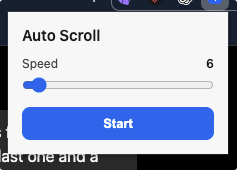

# Auto Scroll

A tiny Chrome extension that scrolls the current page for you. Set the speed, hit Start, and it keeps going — even after you close the popup. When it hits the bottom, it jumps back to the top and loops.

  

## Install for development

1. Clone this repo
2. `npm install`
3. `npm run build`
4. Open Chrome → `chrome://extensions`
5. Turn on **Developer mode** (top right)
6. Click **Load unpacked**
7. Select the `auto-scroll/dist` folder

## Use

1. Open any normal webpage (`http` / `https`)
2. Click the extension icon
3. Drag the **Speed** slider (1–100)
4. Hit **Start** / **Stop**

You can also press `Ctrl+Shift+S` (or `Cmd+Shift+S` on macOS) to start or stop.

Scrolling keeps running after you close the popup. Reopen it to stop or change speed.

## After updating

Run `npm run build`, then on `chrome://extensions` click the reload button on Auto Scroll and refresh the page you’re testing.

## Scripts

- `npm run build` — bundle the extension into `dist/`
- `npm run zip` — build and package `dist.zip` for the Chrome Web Store
- `npm run test` — run unit tests
- `npm run lint` — lint the source

## How it works

The popup injects a small scroll API into the active tab (`chrome.scripting`, `MAIN` world). The page-side API picks the best scrollable target (document or a large overflow container), advances at a steady frame-aligned rate, and wraps to the top at the bottom. State lives in the page so scrolling continues after the popup closes. A service worker handles keyboard shortcuts.

## License

[MIT](LICENSE)
